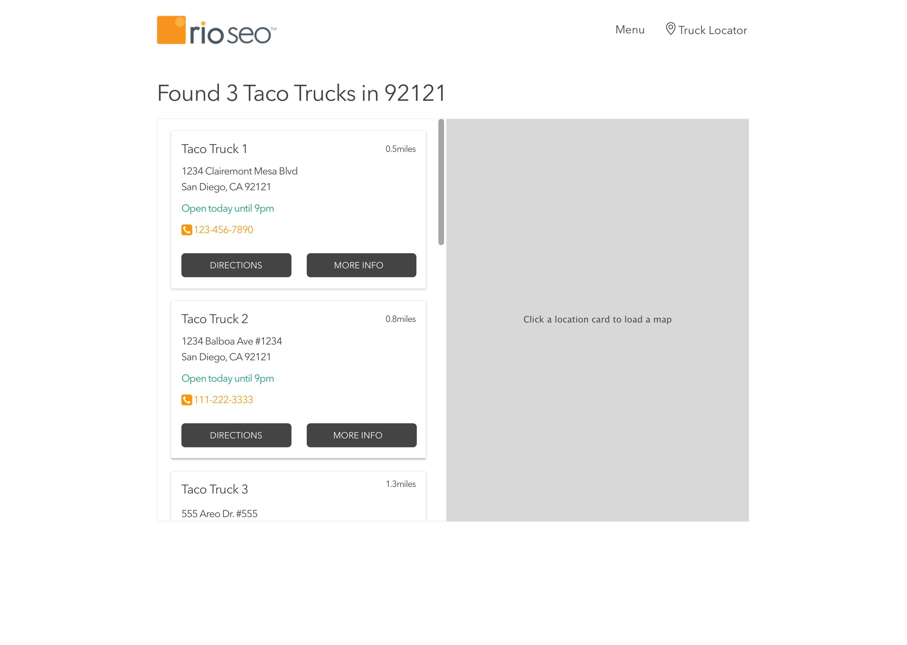
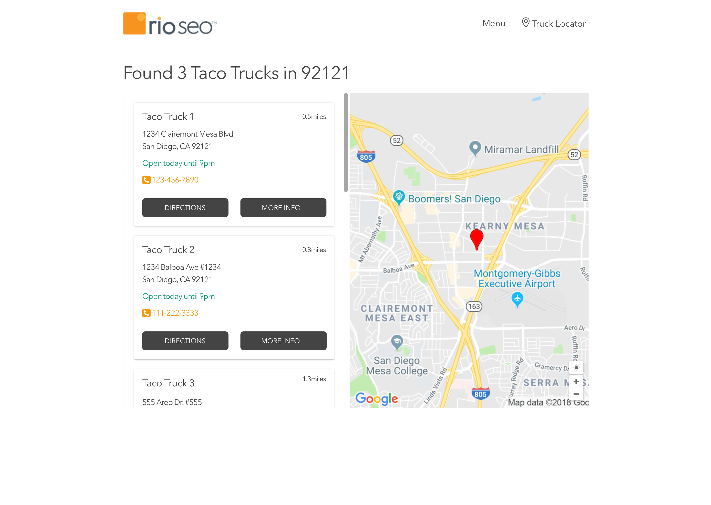
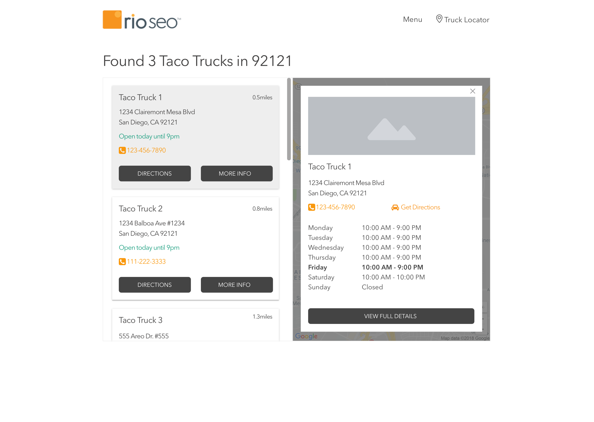
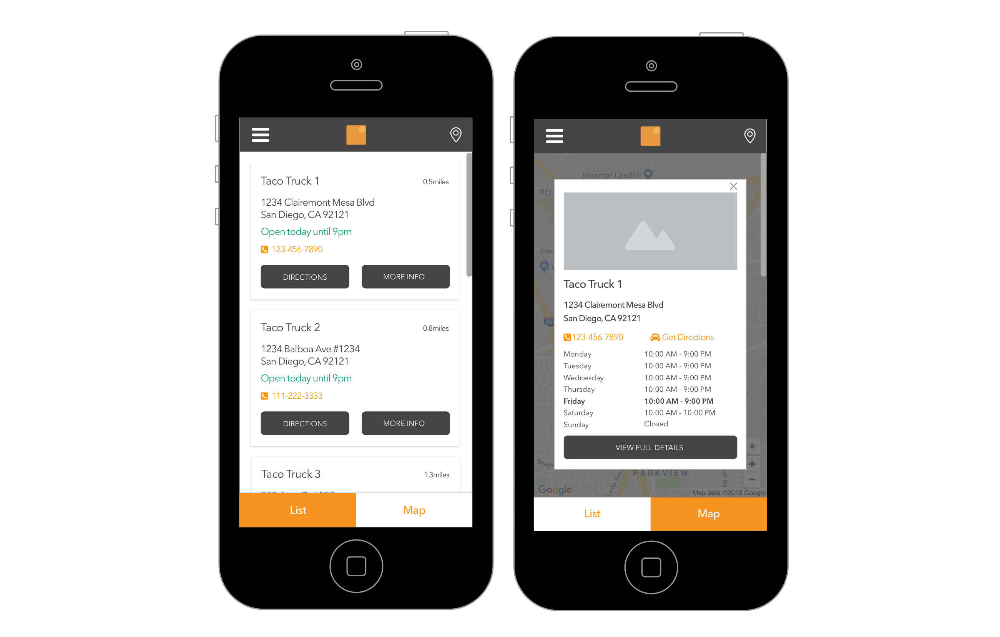

# Taco Truck Locator Code Assessment

Taco Truck Co. would like a simple truck locator to be created. This locator will show the businesses where the taco trucks are parked in front of.

You are given an API call that provides you with this location data in JSON format. The API call will respond to GET requests to the following URL: https://my.api.mockaroo.com/locations.json?key=a45f1200

Here is a single locations sample data:
```json
{
    "id": 1,
    "name": "Schmeler Inc",
    "url": "http://mapy.cz/quam/sapien/varius/ut.jsp",
    "address": "742 Bashford Court",
    "city": "Fort Wayne",
    "state": "IN",
    "postal_code": "46862",
    "latitude": "41.0938",
    "longitude": "-85.0707",
    "monday_open": "9:41 AM",
    "monday_close": "4:42 PM",
    "tuesday_open": "9:08 AM",
    "tuesday_close": "9:49 PM",
    "wednesday_open": "6:56 AM",
    "wednesday_close": "5:15 PM",
    "thursday_open": "9:57 AM",
    "thursday_close": "8:10 PM",
    "friday_open": "6:43 AM",
    "friday_close": "5:31 PM",
    "saturday_open": "6:45 AM",
    "saturday_close": "4:43 PM",
    "sunday_open": "8:14 AM",
    "sunday_close": "4:05 PM"
}
```

__The final project should look similar these mocks:__ 
1. Initial load screen will present a list of locations.


2. When you click or tap on a location address card from the list, a static map with that location latitude and longitude should be asyncronously rendered.


3. When you click or tap the "MORE INFO" button, an overlay with extended location data will load asyncronosly.


4. From the overlay, the "VIEW FULL DETAILS" should open the location's url in a new window.

5. When you click or tap "DIRECTIONS", open Google Maps in a new window with the locations address populated as the end point for the route.

6. The website should be responsive such that the mobile interface looks like the following mocks.



# Getting Started with Create React App

This project was bootstrapped with [Create React App](https://github.com/facebook/create-react-app).

## Available Scripts

In the project directory, you can run:

### `yarn start`

Runs the app in the development mode.\
Open [http://localhost:3000](http://localhost:3000) to view it in the browser.

The page will reload if you make edits.\
You will also see any lint errors in the console.

### `yarn test`

Launches the test runner in the interactive watch mode.\
See the section about [running tests](https://facebook.github.io/create-react-app/docs/running-tests) for more information.

### `yarn build`

Builds the app for production to the `build` folder.\
It correctly bundles React in production mode and optimizes the build for the best performance.

The build is minified and the filenames include the hashes.\
Your app is ready to be deployed!

See the section about [deployment](https://facebook.github.io/create-react-app/docs/deployment) for more information.

### `yarn eject`

**Note: this is a one-way operation. Once you `eject`, you can’t go back!**

If you aren’t satisfied with the build tool and configuration choices, you can `eject` at any time. This command will remove the single build dependency from your project.

Instead, it will copy all the configuration files and the transitive dependencies (webpack, Babel, ESLint, etc) right into your project so you have full control over them. All of the commands except `eject` will still work, but they will point to the copied scripts so you can tweak them. At this point you’re on your own.

You don’t have to ever use `eject`. The curated feature set is suitable for small and middle deployments, and you shouldn’t feel obligated to use this feature. However we understand that this tool wouldn’t be useful if you couldn’t customize it when you are ready for it.

## Learn More

You can learn more in the [Create React App documentation](https://facebook.github.io/create-react-app/docs/getting-started).

To learn React, check out the [React documentation](https://reactjs.org/).

### Code Splitting

This section has moved here: [https://facebook.github.io/create-react-app/docs/code-splitting](https://facebook.github.io/create-react-app/docs/code-splitting)

### Analyzing the Bundle Size

This section has moved here: [https://facebook.github.io/create-react-app/docs/analyzing-the-bundle-size](https://facebook.github.io/create-react-app/docs/analyzing-the-bundle-size)

### Making a Progressive Web App

This section has moved here: [https://facebook.github.io/create-react-app/docs/making-a-progressive-web-app](https://facebook.github.io/create-react-app/docs/making-a-progressive-web-app)

### Advanced Configuration

This section has moved here: [https://facebook.github.io/create-react-app/docs/advanced-configuration](https://facebook.github.io/create-react-app/docs/advanced-configuration)

### Deployment

This section has moved here: [https://facebook.github.io/create-react-app/docs/deployment](https://facebook.github.io/create-react-app/docs/deployment)

### `yarn build` fails to minify

This section has moved here: [https://facebook.github.io/create-react-app/docs/troubleshooting#npm-run-build-fails-to-minify](https://facebook.github.io/create-react-app/docs/troubleshooting#npm-run-build-fails-to-minify)
# locater_app
